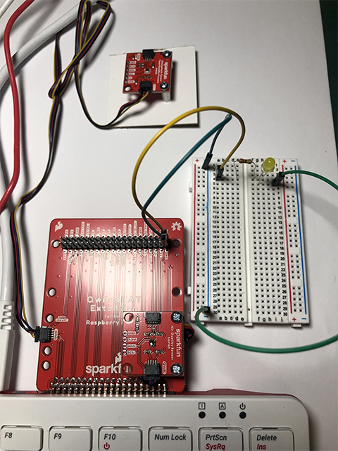

# Blinking an LED from Scratch and Python 3

In this lesson we’ll complete our first physical computing experiments: we’ll connect an LED to our Raspberry Pi, and make it blink.

## Getting started
For this exercise, you will need the following:
* Raspberry Pi 400 computer
* Sparkfun Qwiic pHAT Extension
* One single-color LED
* Two male-to-female (M-to-F) jumper wires

> M-to-F: metal pin + black end

* One male-to-male jumper wire

> M-to-M: both ends have metal pin

* One 330 Ohm resistor

---

*Start with your Raspberry Pi 400 computer turned off.*

## Assembling the pHAT

We need to make connections from the Raspberry Pi 400 circuit board: GPIO (general-purpose input-output).
There are 40 male pins (metal pin) available to use for power, communication and hardware.


1. Collect one M-to-F pin. Take the female end (black) and insert it into the GND (ground) on the pHAT male pin.


2. Collect the other M-to-F pin. Take the female end (black) and insert into 21 on the pHAT male pin.


## Wire to the Breadboard

A breadboard is 

3. Take the male end of the M-to-F pin connected to GND and insert it into column (-) in row 1 of the breadboard.


4. Take the male end of the other M-to-F pin connected to 21 and insert it into the column (a) in row 4 of the breadboard.


5. Collect the M-to-M pin. Take one end and insert it into column (-) in row 30 of the breadboard.


6. Take the other end of the M-to-M pin and insert it into column (j) in row 5 of the breadboard.


## Adding the 330 ohm resistor

A resistor is 

7. Pick up the resistor and look at the color combination. It reads orange, red, brown gold. 


8. Take the orange end of the resistor and insert it into column (e) in row 4 of the breadboard.
9. Take the brown end of the resister and insert it into column (f) in row 4. 


## Adding the LED

A LED is a light emitting diode. It two legs, one is longer than the other. The longer leg is the anode, positively charged. 


10. Take the longer leg of the LED and insert it into column (g) in row 4.
11. Take the shorter leg of the LED and insert it into column (g) in row 5.


## Power the system

12. Your connection of the electronics is all set-up.



13. Turn on the Raspberry Pi 400. The pHAT and power will light up red.


---
## Write a Scratch 3 program
For this part of the exercise, you will go to the Raspberry icon, click on 

14. 

## Write a Python 3 program


```python
from gpiozero import LED
from time import sleep

led = LED(21)

while True:
    led.on()
    sleep(1.0)
    led.off()
    sleep(1.0)
```
